---

## Sobre mim

Sou estudante de Análise e Desenvolvimento de Sistemas, interessada em explorar diferentes áreas da Computação por meio de estudos, projetos e experimentos.

Tenho interesse principalmente em:

- Inteligência Artificial
- Processamento de Linguagem Natural
- Desenvolvimento de Software
- Estruturas de Dados e Algoritmos
- Automação de processos

---

## Tecnologias

Tecnologias com as quais já tive contato durante meus estudos:

---

## Ferramentas

---

## Estatísticas

---

## Contato

 

  

🌱 Em constante aprendizado e exploração.

